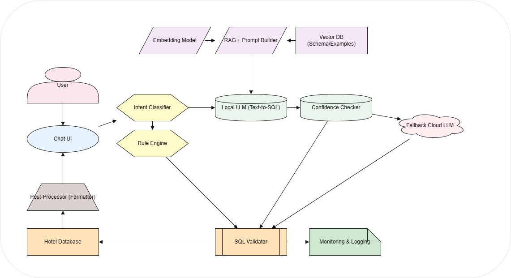

<div align="center">

# Offline Hybrid AI Chatbot for Structured Data Querying

### With Tool Calling & Optional Cloud Escalation

[](https://python.org)
[](https://ollama.com)
[](https://www.postgresql.org)
[](https://www.mysql.com)
[](LICENSE)

*A privacy-first, hybrid AI chatbot that converts natural language into structured database queries, executes tool-based actions, and optionally escalates to cloud LLMs when needed.*

</div>

---

## Table of Contents

- [Executive Summary](#-executive-summary)
- [Problem Statement](#-problem-statement)
- [Architecture Overview](#-architecture-overview)
- [Architectural Layers](#-architectural-layers)
- [Tool Calling Layer](#-tool-calling-layer)
- [Local LLM Layer](#-local-llm-layer)
- [RAG (Optional)](#-retrieval-augmented-generation-rag)
- [SQL Execution Layer](#-sql-execution-layer)
- [Confidence-Based Escalation](#-confidence-based-escalation)
- [Monitoring & Logging](#-monitoring--logging)
- [Design Principles](#-design-principles)
- [Technology Stack](#-technology-stack)
- [Deployment](#-deployment)
- [Hardware Requirements](#-hardware-requirements)
- [Scalability & Concurrent User Capacity](#-scalability--concurrent-user-capacity)
- [Roadmap](#-roadmap)
- [Risk Analysis](#-risk-analysis)
- [Future Extensions](#-future-extensions)

---

## Executive Summary

This project proposes the design and implementation of a **hybrid, offline-first AI chatbot system** capable of:

- Understanding natural language queries
- Converting them into structured database queries
- Executing them safely
- Returning precise results
- Performing tool-based actions when required

> **Primary Use Case:** Querying structured hotel management data (rooms, bookings, payments, customers).

| Capability | Status |
|---|---|
| High Accuracy | :white_check_mark: |
| Low Operational Cost | :white_check_mark: |
| Scalability | :white_check_mark: |
| Privacy (Local-First) | :white_check_mark: |
| Extensibility | :white_check_mark: |

---

## Problem Statement

We want to allow users (e.g., hotel owners, staff) to ask questions like:

> *"Who stayed in Room 302 on Feb 10?"*
>
> *"How much revenue did we generate last month?"*
>
> *"Generate invoice for booking ID 1452."*
>
> *"Export occupancy report for March."*

**Without:**

- :lock: Sending sensitive data to external APIs
- :moneybag: Incurring uncontrolled token costs
- :x: Sacrificing query accuracy

---

## Architecture Overview

The system follows a **hybrid layered architecture** with local-first processing and optional cloud escalation.

<div align="center">

### System Architecture



*Figure: End-to-end architecture showing the flow from User through Intent Classification, Local LLM, RAG, SQL Validation, and optional Cloud Fallback.*

</div>

<br>

```
                         ┌─────────────────┐
                         │      User       │
                         └────────┬────────┘
                                  │
                         ┌────────▼────────┐
                         │     Chat UI     │
                         └────────┬────────┘
                                  │
                    ┌─────────────▼─────────────┐
                    │   Intent & Routing Layer   │
                    │  ┌───────┐  ┌───────────┐  │
                    │  │ Rules │  │ Classifier │  │
                    │  └───┬───┘  └─────┬─────┘  │
                    └──────┼────────────┼────────┘
                           │            │
              ┌────────────▼──┐  ┌──────▼────────────┐
              │  Tool Router  │  │ Local LLM + RAG    │
              │  → Invoker    │  │ (Text-to-SQL)      │
              └───────────────┘  └──────┬─────────────┘
                                        │
                              ┌─────────▼─────────┐
                              │   SQL Validator    │
                              └─────────┬─────────┘
                                        │
                              ┌─────────▼─────────┐
                              │  Hotel Database    │
                              └─────────┬─────────┘
                                        │
                              ┌─────────▼─────────┐
                              │  Post-Processing   │
                              └─────────┬─────────┘
                                        │
                              ┌─────────▼─────────┐
                              │  Response to User  │
                              └───────────────────┘

            (Optional) Low Confidence ──▶ Cloud LLM Escalation
```

---

## Architectural Layers

### 4.1 User Interaction Layer

| Component | Description |
|---|---|
| **User** | Hotel Owner / Staff |
| **Chat UI** | Web-based interface (React / HTML / Internal Dashboard) |

**Responsibilities:**
- Accept natural language queries
- Display responses (text, tables, charts)
- Display action confirmations (tool execution results)

---

### 4.2 Intent & Routing Layer

This layer decides **how** the query should be handled.

#### Intent Classifier

A lightweight model or rule-based classifier using:
- `scikit-learn` (TF-IDF + Logistic Regression)
- `spaCy`
- Tiny local LLM

**Output Categories:**

| Category | Description |
|---|---|
| `structured_query` | Database lookup queries |
| `faq` | Frequently asked questions |
| `tool_request` | Action-based requests |
| `complex_reasoning` | Multi-step analytical queries |
| `unknown` | Unrecognized intents |

#### Rule Engine

Handles deterministic responses for known commands:

> *"What is check-in time?"* | *"Show today's bookings."*

#### Tool Router

Routes action-based intents to the Tool Calling Layer:

> *"Generate invoice"* | *"Export report"* | *"Send email"*

---

## Tool Calling Layer

This layer allows the chatbot to **execute actions**, not just answer questions.

### 5.1 Tool Router

Determines if a tool must be invoked based on the classified intent.

### 5.2 Tool Registry

A structured catalog of available tools:

```json
{
  "generate_invoice": {
    "parameters": ["booking_id"],
    "description": "Generate PDF invoice for booking"
  },
  "export_report": {
    "parameters": ["month"],
    "description": "Export occupancy report"
  }
}
```

### 5.3 Tool Invoker

Executes backend logic with strict safety constraints:

```python
generate_invoice(booking_id)
export_room_data(room_no, month)
email_report(email, result)
```

**Security Constraints:**
- :shield: Parameter validation
- :closed_lock_with_key: Role-based permission checks
- :pencil: Audit logging

---

## Local LLM Layer

The primary AI engine for structured query processing.

### 6.1 Model Choice

A wide range of open-source LLMs can be used depending on hardware constraints, accuracy requirements, and domain needs:

#### Recommended Models

| Model | Parameters | Best For | Notes |
|---|---|---|---|
| **Mistral 7B** | 7B | General-purpose (Recommended Default) | Excellent instruction-following, fast inference |
| **Mixtral 8x7B** | 46.7B (MoE) | High-accuracy complex queries | Mixture-of-Experts, only ~12.9B active params |
| **LLaMA 3.1 8B** | 8B | High-capability balanced option | Meta's latest, strong reasoning |
| **LLaMA 3.1 70B** | 70B | Maximum accuracy (GPU required) | Best open-source quality, needs significant VRAM |
| **LLaMA 3.2 3B** | 3B | Lightweight edge deployment | Compact yet capable |

#### Lightweight / Edge Models

| Model | Parameters | Best For | Notes |
|---|---|---|---|
| **TinyLlama** | 1.1B | Ultra-low resource environments | Minimal footprint, basic tasks |
| **Phi-3 Mini** | 3.8B | On-device / edge deployment | Microsoft, strong for its size |
| **Phi-3 Small** | 7B | Balanced edge performance | Microsoft, good reasoning |
| **Phi-3 Medium** | 14B | Higher edge accuracy | Microsoft, excellent quality-to-size ratio |
| **Gemma 2 2B** | 2B | Lightweight local inference | Google, efficient and compact |
| **Gemma 2 9B** | 9B | Quality local inference | Google, strong benchmark scores |
| **Gemma 2 27B** | 27B | High-quality local inference | Google, near-frontier performance |
| **Qwen 2.5 7B** | 7B | Multilingual + code tasks | Alibaba, strong coding ability |
| **Qwen 2.5 72B** | 72B | Maximum multilingual accuracy | Alibaba, competitive with top models |

#### Code & SQL Specialized Models

| Model | Parameters | Best For | Notes |
|---|---|---|---|
| **CodeLlama 7B** | 7B | SQL generation focus | Meta, fine-tuned for code tasks |
| **CodeLlama 34B** | 34B | Advanced SQL & code generation | Meta, superior code understanding |
| **DeepSeek Coder V2** | 16B / 236B | Code-heavy pipelines | Strong at structured output generation |
| **StarCoder2 7B** | 7B | Code completion & SQL | BigCode, trained on massive code corpus |
| **SQLCoder 7B** | 7B | Text-to-SQL (purpose-built) | Defog.ai, specifically trained for SQL generation |
| **NSQL 6B** | 6B | Natural language to SQL | NumbersStation, SQL-specialized |

#### Large-Scale / High-Accuracy Models

| Model | Parameters | Best For | Notes |
|---|---|---|---|
| **Falcon 40B** | 40B | Large-scale deployments | TII, strong open-source performer |
| **Yi 34B** | 34B | Bilingual (EN/CN) high accuracy | 01.AI, excellent reasoning |
| **Vicuna 13B** | 13B | Conversational + instruction tasks | Fine-tuned from LLaMA, good chat quality |
| **Solar 10.7B** | 10.7B | Balanced performance | Upstage, depth-upscaled architecture |
| **Command R+** | 104B | Enterprise RAG & tool use | Cohere, optimized for RAG workflows |
| **InternLM 2.5 7B** | 7B | Tool calling & structured output | Strong function-calling ability |

> **Tip:** For this project's primary use case (Text-to-SQL for hotel data), **SQLCoder 7B**, **Mistral 7B**, or **CodeLlama 7B** are the best starting points. Scale up to larger models only if accuracy requirements demand it.

**Deployment via:** `Ollama` | `llama.cpp` | `vLLM` | `text-generation-inference (TGI)`

### 6.2 Responsibilities

- Convert natural language to SQL
- Generate structured tool calls (JSON format)
- Summarize query results

### 6.3 Prompt Strategy

Each prompt includes:
- Full database schema
- Few-shot examples
- Guardrail instructions
- Output format constraints

**Expected output format:**

```json
{
  "sql": "SELECT ...",
  "confidence": 0.92
}
```

---

## Retrieval-Augmented Generation (RAG)

> *Optional layer to improve SQL accuracy.*

### Components

| Component | Technology |
|---|---|
| Vector DB | Chroma / Faiss / LanceDB |
| Embedding Model | `sentence-transformers` |
| Prompt Builder | Custom pipeline |

### Purpose

- Retrieve relevant schema sections dynamically
- Provide contextual example queries
- Reduce hallucinated column names

---

## SQL Execution Layer

### 8.1 SQL Validator

Enforces strict safety rules:

| Rule | Description |
|---|---|
| `SELECT`-only | No `DELETE` / `UPDATE` / `DROP` |
| Row limits | Prevents excessive data retrieval |
| Safe execution | Parameterized queries only |

### 8.2 Hotel Database

| Option | Best For |
|---|---|
| **SQLite** | Development / Lightweight |
| **PostgreSQL** | Production / Scalable |
| **MySQL** | Alternative production DB |

**Schema includes:** `Bookings` | `Rooms` | `Customers` | `Payments`

### 8.3 Post-Processor

Transforms raw SQL results into:
- Natural language response
- Formatted tables
- Charts (optional)

---

## Confidence-Based Escalation

### 9.1 Confidence Checker

Measures:
- Log probability of LLM output
- Output validity and formatting
- SQL parsing success

> If confidence falls below threshold &rarr; **escalate to cloud**.

### 9.2 Optional Cloud Fallback

Used **only** for:
- Deep reasoning queries
- Complex analytics
- Multi-hop reasoning

| Cloud API | Provider |
|---|---|
| GPT-4 | OpenAI |
| Claude | Anthropic |
| Gemini | Google |

**Escalation Flow:**

```
Local LLM ──▶ Confidence Check ──▶ Below Threshold? ──▶ Cloud LLM
                                          │
                                    Above Threshold
                                          │
                                          ▼
                                   Return Result
```

---

## Monitoring & Logging

| Metric | Purpose |
|---|---|
| Query logs | Audit trail |
| SQL generation accuracy | Quality assurance |
| Escalation rate | Cost optimization |
| Tool usage | Usage analytics |
| Failures | Error tracking |

**Goals:** Continuous improvement, cost optimization, accuracy tuning.

---

## Design Principles

| Principle | Description |
|---|---|
| :lock: **Local-First Privacy** | Sensitive data never leaves the network |
| :moneybag: **Cost Efficiency** | Minimize cloud API usage |
| :dart: **High Precision** | Schema-aware prompts for accurate SQL |
| :brain: **Hybrid Intelligence** | Local + Cloud when needed |
| :arrows_counterclockwise: **Continuous Learning** | Improve from logged interactions |
| :shield: **Safe Execution** | Strict SQL validation and sandboxing |
| :chart_with_upwards_trend: **Scalable Architecture** | Grow from laptop to production server |

---

## Technology Stack

| Component | Technology |
|---|---|
| **UI** | React / HTML + FastAPI |
| **Backend** | Python |
| **Local LLM** | Ollama / llama.cpp |
| **Embeddings** | sentence-transformers |
| **Vector DB** | Chroma / Faiss |
| **SQL Database** | PostgreSQL / SQLite |
| **Orchestration** | LangChain / Custom |
| **Tool Execution** | Python Dispatcher |
| **Monitoring** | Custom logging + dashboards |

---

## Deployment

<table>
<tr>
<td width="50%">

### Development

- Local laptop (CPU quantized model)
- Google Colab (optional)

</td>
<td width="50%">

### Production

- On-prem server
- Dedicated GPU (optional)
- Secure internal network

</td>
</tr>
</table>

---

## Hardware Requirements

Hardware needs vary significantly based on the chosen LLM size and quantization level. Below are guidelines for each deployment tier.

### Minimum Requirements (1B–3B Models)

> *Suitable for: TinyLlama, Gemma 2 2B, LLaMA 3.2 3B, Phi-3 Mini*

| Component | Specification |
|---|---|
| **CPU** | 4-core modern x86_64 (Intel i5 / AMD Ryzen 5 or better) |
| **RAM** | 8 GB |
| **Storage** | 10 GB free (model + database + application) |
| **GPU** | Not required (CPU inference is viable) |
| **OS** | Linux / Windows / macOS |

**Expected Inference Speed:** ~5–15 tokens/sec on CPU

---

### Recommended Requirements (7B–14B Models)

> *Suitable for: Mistral 7B, LLaMA 3.1 8B, CodeLlama 7B, SQLCoder 7B, Phi-3 Medium, Gemma 2 9B, Qwen 2.5 7B*

| Component | Specification |
|---|---|
| **CPU** | 8-core modern x86_64 (Intel i7 / AMD Ryzen 7 or better) |
| **RAM** | 16–32 GB |
| **Storage** | 20–30 GB free |
| **GPU (Recommended)** | NVIDIA GPU with 8+ GB VRAM (RTX 3060, RTX 4060, T4) |
| **OS** | Linux (preferred) / Windows / macOS |

**Expected Inference Speed:** ~15–30 tokens/sec (GPU) · ~3–8 tokens/sec (CPU with Q4 quantization)

---

### High-Performance Requirements (30B–72B Models)

> *Suitable for: LLaMA 3.1 70B, Mixtral 8x7B, Qwen 2.5 72B, Falcon 40B, CodeLlama 34B, Yi 34B*

| Component | Specification |
|---|---|
| **CPU** | 16+ core server-grade (Intel Xeon / AMD EPYC) |
| **RAM** | 64–128 GB |
| **Storage** | 80–150 GB free (SSD strongly recommended) |
| **GPU (Required)** | 1–2x NVIDIA GPUs with 24+ GB VRAM each (RTX 3090, RTX 4090, A100, H100) |
| **OS** | Linux (Ubuntu 22.04+ recommended) |

**Expected Inference Speed:** ~20–40 tokens/sec (multi-GPU) · ~1–3 tokens/sec (CPU, not recommended)

---

### Enterprise / Multi-User Production Server

> *For concurrent users, high throughput, and low latency*

| Component | Specification |
|---|---|
| **CPU** | 32+ core server-grade |
| **RAM** | 128–256 GB |
| **Storage** | 500 GB+ NVMe SSD |
| **GPU** | 2–4x NVIDIA A100 (80 GB) or H100 |
| **Network** | 10 Gbps internal network |
| **OS** | Linux (Ubuntu 22.04+ / RHEL 9+) |

**Additional considerations:**
- Load balancer for multi-instance deployment
- Redis / message queue for request buffering
- Kubernetes or Docker Swarm for orchestration

---

### Quantization Impact on VRAM

Quantization dramatically reduces memory requirements. Below is an approximate guide:

| Model Size | FP16 (Full) | Q8 (8-bit) | Q4 (4-bit) | Q2 (2-bit) |
|---|---|---|---|---|
| **3B** | ~6 GB | ~3 GB | ~2 GB | ~1.2 GB |
| **7B** | ~14 GB | ~7 GB | ~4 GB | ~2.5 GB |
| **13B** | ~26 GB | ~13 GB | ~7.5 GB | ~4.5 GB |
| **34B** | ~68 GB | ~34 GB | ~20 GB | ~12 GB |
| **70B** | ~140 GB | ~70 GB | ~40 GB | ~24 GB |

> **Recommendation for this project:** Start with a **Q4-quantized 7B model** (e.g., Mistral 7B or SQLCoder 7B) on a machine with **16 GB RAM and an 8 GB VRAM GPU**. This provides an excellent balance of accuracy, speed, and cost for the hotel data querying use case.

---

### Cloud / Colab Alternatives

If local hardware is insufficient, these cloud options work well for development and testing:

| Platform | Free Tier GPU | Best For |
|---|---|---|
| **Google Colab** | T4 (15 GB VRAM) | Prototyping with 7B models |
| **Kaggle Notebooks** | T4 / P100 (16 GB VRAM) | Free experimentation |
| **Lambda Cloud** | A100 (rent) | Production-grade testing |
| **RunPod** | Various GPUs (rent) | Flexible on-demand inference |
| **Vast.ai** | Various GPUs (rent) | Budget-friendly GPU rental |

---

## Roadmap

```
Phase 1 – Core               Phase 2 – Reliability       Phase 3 – Tools            Phase 4 – Optimization
──────────────────           ──────────────────────      ────────────────────       ──────────────────────
 ▸ Intent Classifier          ▸ RAG Integration           ▸ Tool Registry            ▸ Escalation Tuning
 ▸ Local LLM                  ▸ Confidence Scoring        ▸ Tool Invoker             ▸ Model Fine-Tuning
 ▸ SQL Generator              ▸ Logging                   ▸ Action Auditing          ▸ Performance Scaling
 ▸ SQL Validator
 ▸ Basic UI
```

---

## Scalability & Concurrent User Capacity

When offering this system as a **SaaS / hosted product**, the key bottleneck is LLM inference throughput. Below is a detailed analysis of how many customers (concurrent users) can be served across different deployment configurations.

---

### Understanding the Bottleneck

Each user query triggers this pipeline:

```
User Query → Intent Classification (~5ms) → LLM Inference (~0.5–10s) → SQL Execution (~10–50ms) → Response
```

> **LLM inference dominates total latency.** All other components (intent classifier, SQL execution, post-processing) are negligible in comparison.

**Key metrics:**
- **Tokens per query:** ~50–200 input tokens, ~30–100 output tokens
- **Time per query:** Primarily determined by model size and hardware
- **Acceptable latency:** < 3 seconds for interactive chat experience

---

### Single-Server Capacity Estimates

<table>
<tr>
<th>Configuration</th>
<th>Hardware</th>
<th>Model</th>
<th>Queries/Min</th>
<th>Concurrent Users</th>
<th>Monthly Cost (est.)</th>
</tr>
<tr>
<td><strong>Starter</strong></td>
<td>8-core CPU, 32 GB RAM, no GPU</td>
<td>Q4 Mistral 7B</td>
<td>~4–8</td>
<td><strong>5–10</strong></td>
<td>$50–100 (cloud VM)</td>
</tr>
<tr>
<td><strong>Small Business</strong></td>
<td>16-core CPU, 32 GB RAM, 1x RTX 4060 (8 GB)</td>
<td>Q4 Mistral 7B</td>
<td>~15–25</td>
<td><strong>20–40</strong></td>
<td>$150–300</td>
</tr>
<tr>
<td><strong>Mid-Tier</strong></td>
<td>32-core CPU, 64 GB RAM, 1x RTX 4090 (24 GB)</td>
<td>Q4 Mistral 7B + batching</td>
<td>~30–60</td>
<td><strong>50–100</strong></td>
<td>$400–700</td>
</tr>
<tr>
<td><strong>Professional</strong></td>
<td>64-core CPU, 128 GB RAM, 2x A100 (80 GB)</td>
<td>Mistral 7B FP16 + vLLM</td>
<td>~100–200</td>
<td><strong>150–300</strong></td>
<td>$1,500–3,000</td>
</tr>
<tr>
<td><strong>Enterprise</strong></td>
<td>Multi-node cluster, 4–8x A100/H100</td>
<td>Mistral 7B / Mixtral, vLLM cluster</td>
<td>~500–1,500</td>
<td><strong>500–2,000+</strong></td>
<td>$5,000–15,000</td>
</tr>
</table>

> **Assumptions:** Average user sends ~1 query every 30–60 seconds during an active session. "Concurrent Users" means active users in the same time window, not total registered users.

---

### Multi-Tenant SaaS Architecture

For serving multiple customers (e.g., multiple hotels), the system needs a multi-tenant design:

```
                    ┌──────────────────────────────────┐
                    │        Load Balancer (Nginx)      │
                    └──────────┬───────────────────────┘
                               │
            ┌──────────────────┼──────────────────┐
            │                  │                  │
    ┌───────▼───────┐  ┌──────▼────────┐  ┌──────▼────────┐
    │  App Server 1 │  │  App Server 2 │  │  App Server N │
    │  (FastAPI)    │  │  (FastAPI)    │  │  (FastAPI)    │
    └───────┬───────┘  └──────┬────────┘  └──────┬────────┘
            │                 │                   │
    ┌───────▼─────────────────▼───────────────────▼───────┐
    │              LLM Inference Pool (vLLM / TGI)         │
    │         GPU Node 1  │  GPU Node 2  │  GPU Node N     │
    └───────┬─────────────────────────────────────────────┘
            │
    ┌───────▼──────────────────────────────────┐
    │     Database Layer (per-tenant isolation) │
    │  ┌──────────┐ ┌──────────┐ ┌──────────┐  │
    │  │ Hotel A  │ │ Hotel B  │ │ Hotel C  │  │
    │  │   DB     │ │   DB     │ │   DB     │  │
    │  └──────────┘ └──────────┘ └──────────┘  │
    └──────────────────────────────────────────┘
```

**Key components:**
- **Load Balancer** distributes requests across app servers
- **Request Queue** (Redis / RabbitMQ) buffers queries during peak load
- **LLM Inference Pool** runs multiple model replicas with continuous batching
- **Per-Tenant Database Isolation** ensures data privacy between customers

---

### Scaling Strategies

| Strategy | Impact | Complexity |
|---|---|---|
| **Request Queuing** | Smooth peak load spikes, prevent timeouts | Low |
| **Continuous Batching** (vLLM/TGI) | 2–5x throughput improvement | Medium |
| **Model Replicas** | Linear throughput scaling per GPU added | Medium |
| **Speculative Decoding** | 1.5–2x faster inference, same quality | Medium |
| **Smaller Quantization** (Q4 → Q2) | ~40% more throughput, slight quality drop | Low |
| **Response Caching** | Eliminate repeated queries entirely | Low |
| **Intent-Based Routing** | Skip LLM for FAQ/rule-based queries (~30–50% of traffic) | Low |
| **Horizontal Auto-Scaling** (K8s) | Dynamically add/remove GPU nodes | High |

---

### Capacity Planning by Customer Tier

| Offering Tier | Max Tenants (Hotels) | Active Users / Tenant | Total Concurrent Users | Infra Needed |
|---|---|---|---|---|
| **Free / Trial** | 10–20 | 1–2 | ~20 | 1x small GPU server |
| **Starter Plan** | 50–100 | 2–5 | ~100–200 | 1x mid-tier GPU server |
| **Business Plan** | 200–500 | 5–10 | ~500–1,000 | 2–4x GPU servers + load balancer |
| **Enterprise Plan** | 500–2,000 | 10–50 | ~2,000–10,000 | GPU cluster (8+ nodes) + K8s + auto-scaling |

---

### Cost-per-Query Economics

| Deployment | Cost / 1,000 Queries | vs. Cloud LLM API |
|---|---|---|
| Self-hosted Q4 7B (1x RTX 4090) | **~$0.02–$0.05** | 50–100x cheaper |
| Self-hosted FP16 7B (1x A100) | **~$0.05–$0.10** | 20–50x cheaper |
| Cloud GPU rental (A100 spot) | **~$0.10–$0.25** | 10–20x cheaper |
| GPT-4 API (for comparison) | **~$1.50–$5.00** | Baseline |

> **Key Takeaway:** Self-hosting reduces per-query costs by **20–100x** compared to cloud LLM APIs, making it viable to offer as a SaaS product with healthy margins even at low subscription prices.

---

### Recommended Starting Point (SaaS MVP)

For launching a SaaS product serving **~50 hotel customers** with **~100 concurrent users**:

| Component | Specification |
|---|---|
| **Server** | 1x cloud VM with RTX 4090 or A10G (24 GB VRAM) |
| **Model** | Q4 Mistral 7B or SQLCoder 7B via vLLM |
| **App** | 2x FastAPI workers behind Nginx |
| **Queue** | Redis for request buffering |
| **Database** | PostgreSQL with schema-per-tenant isolation |
| **Monitoring** | Prometheus + Grafana for latency & throughput tracking |
| **Monthly Cost** | ~$400–700 infrastructure |

Scale horizontally by adding GPU nodes as customer count grows.

---

## Risk Analysis

| Risk | Mitigation |
|---|---|
| SQL hallucination | Schema-aware prompts + validation |
| Over-escalation to cloud | Tune confidence threshold |
| Slow inference | Quantization + caching |
| Tool misuse | Strict parameter validation |

---

## Future Extensions

- Multi-tenant architecture
- Role-based access control (RBAC)
- Voice interface integration
- Fine-tuned domain-specific LLM
- Analytics dashboard
- Auto-learning from interaction logs

---

<div align="center">

### This is not just a chatbot.

**It is a controlled AI inference engine for structured business intelligence and automation.**

---

*Built with a vision for privacy, precision, and scalability.*

</div>
